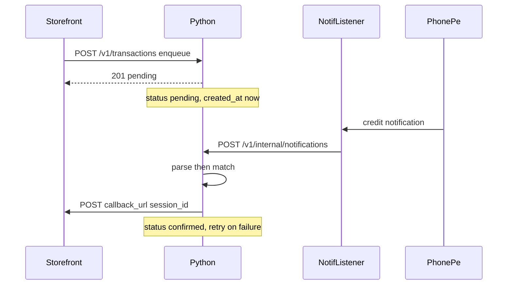

# Module C — Owner Device App Plan

Greenfield repo (only [relay-mvp-prd.md](relay-mvp-prd.md) exists). This pass produces **PLAN.md only** — no implementation code, no Module A/B design, no onboarding/auth/refunds/security hardening.

---

## Flagged decisions (not silent defaults)

- **Flutter ↔ Python: HTTP over loopback.** Python already speaks HTTP for the storefront; Flutter and the native listener use `http://127.0.0.1:8787`. One protocol, curl-debuggable on-device. Rejected: Unix sockets (worse Android/debug story), Dart method-channel passthrough of matching (violates “Python owns all decision logic”), Chaquopy direct function calls for the hot path (would fork a second API besides the storefront surface).
- **Python on device: Chaquopy-embedded CPython, uvicorn started at process boot.** One APK; storefront reaches the same process on `0.0.0.0:8787`. Rejected: Termux sidecar (two apps to launch during a demo).
- **Live operator UI: snapshot polling every 500ms**, not SSE. Enough for the visual match beat; fewer Android HTTP-stream edge cases.
- **Storefront callback URL travels on enqueue** as `callback_url`. C5 cannot guess A5’s URL; this avoids a second config surface on the phone. Optional device-level default in the operator UI only if enqueue omits it.
- **NotificationListenerService POSTs raw events straight to Python loopback.** Flutter is not on the verification hot path (survives UI pause). Flutter still polls Python as UI source of truth.

---

## 1. Architecture (ASCII + ownership)

```
                         LAN / hotspot / tunnel  (§5.1, R4)
  ┌────────────────────┐      POST /v1/transactions     ┌──────────────────────────────────┐
  │  MODULE A          │ ─────────────────────────────▶ │  PYTHON BACKEND  (Chaquopy)      │
  │  Storefront        │     (A2 → C1)                 │  owns: C1, C3, C4, C5, §7, §8    │
  │  (external client) │ ◀───────────────────────────── │                                  │
  └────────────────────┘      POST {callback_url}       │  C1  queue.py + api/storefront.py │
                              {session_id}  (C5 → A5)   │  C3  parser.py                    │
                                                         │  C4  matcher.py  (§7)            │
  ┌────────────────────┐                                │  C5  confirm.py                    │
  │  MODULE B          │   UPI rails → PhonePe notif    │  §8  state.py                     │
  │  (not built)       │ ──────────────────────┐          │  api/internal.py  (Flutter API)  │
  └────────────────────┘                     │          └──────────────▲───────────────────┘
                                              ▼                         │  loopback HTTP
                         ┌──────────────────────────────────────────────┴─────────────────────┐
                         │  FLUTTER APP  (same Android process)                                 │
                         │  owns: C2 (native listener + permission UX), C6 (operator UI)        │
                         │                                                                     │
                         │  Kotlin NotificationListenerService  ──POST /v1/internal/notifications
                         │       filter: com.phonepe.app                                      │
                         │  Dart OperatorScreen  ──GET  /v1/internal/snapshot   (poll 500ms)    │
                         │                      ──POST /v1/internal/transactions/{id}/confirm  │
                         │                         (R1 manual confirm → same C5 path)         │
                         └─────────────────────────────────────────────────────────────────────┘
```



**Ownership**

- **C1 Ingress/Queue** — Python
- **C2 Notification Listener** — Flutter/Kotlin (grant detection, settings intent, PhonePe filter, raw title/body extract). Forwards to Python; does not parse or match
- **C3 Parser** — Python
- **C4 Matcher** — Python (§7)
- **C5 Confirmation sender** — Python
- **C6 Operator UI** — Flutter (reads Python snapshot; access/DND are device-side)
- **§8 State machine** — Python (`created` is storefront-only; device sees `pending|confirmed|expired`)
- **R1, R2, R3, R5, R4-posture** — listed in §8 of this plan

---

## 2. Python backend structure

**Framework: FastAPI + uvicorn + Pydantic.** Typed request bodies for the A2/A5 contract, runs in a background thread under Chaquopy, no extra web stack.

```
backend/
  requirements.txt              # fastapi, uvicorn, pydantic
  app/
    main.py                     # FastAPI app, CORS for storefront origin, lifespan: start expiry sweeper + confirm retry loop
    config.py                   # port 8787, bind 0.0.0.0, expiry 300s, PhonePe package id
    models.py                   # PendingEntry, CreditEvent, MatchEvent
    queue.py                    # C1 in-memory store + asyncio.Lock
    parser.py                   # C3 amount/name extract; drop non-credits
    matcher.py                  # C4 + §7 ordered rules
    state.py                    # §8 transitions + single-confirm guard
    confirm.py                  # C5 POST callback_url + short backoff retry
    events.py                   # ring buffers: credits, matches (operator snapshot)
    api/
      storefront.py             # C1 POST /v1/transactions  (A2 contract)
      internal.py               # Flutter/native: notifications, snapshot, R1 confirm
    fixtures/
      phonepe_credits.json       # R3 captured strings from the demo handset
  tests/
    test_parser.py              # fixtures → amount/name; non-credits discarded
    test_matcher.py              # §7 rules 1–6
    test_state.py               # pending→confirmed|expired; no double-confirm
    test_confirm.py             # retry; manual confirm shares send path
```

**In-memory C1 entry:** `session_id`, `customer_name`, `amount` (Decimal, 2 dp), `created_at` (device clock), `status`, `callback_url`, `confirm_acked` (internal; public status stays `confirmed` even while retries run).

**C5 retry:** on match or R1, set `confirmed` immediately (blocks rematch, §7 rule 6), enqueue outbound job; backoff ~0.5s / 1s / 2s / 4s until 2xx. Do not revert to `pending` on HTTP failure.

**Expiry sweeper:** every 1s, `pending` with age > 300s → `expired`. No storefront callback on expiry (PRD does not require it).

**CORS:** allow browser origins so Module A can enqueue from the customer laptop. Not auth, not rate limits.

---

## 3. Flutter app structure

```
owner_app/
  lib/
    main.dart                      # start UI; Kotlin Application starts uvicorn before Dart
    api/
      python_client.dart           # loopback client: snapshot, manual confirm
    notification/
      notification_bridge.dart    # EventChannel: permission state, optional echo
    ui/
      operator_screen.dart         # single screen (§C6)
      widgets/
        access_status.dart         # C6-1 + R2: granted/denied; tap → notification listener settings
        dnd_status.dart           # R5: warn if interruption filter / DND on
        pending_list.dart         # C6-2: name, amount, elapsed; row action = R1
        credit_feed.dart           # C6-3
        match_banner.dart         # C6-4 visual resolve
        lan_endpoint.dart          # R4: show http://<lan-ip>:8787 for storefront config
  android/
    app/src/main/kotlin/.../
      RelayApplication.kt         # Chaquopy + start uvicorn bind 0.0.0.0:8787
      NotificationListener.kt     # C2: onNotificationPosted → HTTP POST loopback
      MainActivity.kt
    app/src/main/AndroidManifest.xml
      # BIND_NOTIFICATION_LISTENER_SERVICE, FOREGROUND_SERVICE, INTERNET
```

**C6 single screen (four demo elements + R1)**

- Access indicator (C2 permission; open system notification-access settings if denied)
- Live pending list (name, amount, elapsed)
- Live credit-event feed
- Visual match (pending row + credit collapsing into confirmed)
- Manual confirm on a pending row — **must call Python R1 endpoint**, which runs the identical `confirm.py` path as an automatic match

**C2 native behavior:** observe all posts; keep only `com.phonepe.app`; extract title + text; POST to Python. Do not parse in Kotlin. Grant must be completed at setup (R2), not mid-transaction. Same process as Flutter (no `android:process`) so Chaquopy/uvicorn is reachable.

**Foreground service:** start at launch so iQOO/vivo does not kill the process during the demo. Battery-optimization / autostart is a device checklist item (R2 adjacent), not a product feature.

---

## 4. HTTP contracts (Module A is an external client)

**A2 → C1 — enqueue**

`POST http://<owner>:8787/v1/transactions`

```
{ "session_id": "<opaque>", "customer_name": "...", "amount": "150.00", "callback_url": "https://<storefront>/.../confirm" }
```

- 201: `{ session_id, status: "pending", created_at }`
- 409 if `session_id` already exists (do not reset a live session)
- Amount accepted as string or number; stored as Decimal quantized to 0.01
- `callback_url` required unless operator default is set

**C5 → A5 — confirm (Python is the client)**

`POST {callback_url}`  body `{ "session_id": "...", "status": "confirmed" }`

Retries on network failure. Module A must treat this POST as idempotent (retry may duplicate). **Do not specify A’s screens or poll loop** — only this payload.

**Flutter / native → Python**

- `POST /v1/internal/notifications` `{ package, title, text, posted_at }` → C3 then C4
- `GET /v1/internal/snapshot` → pending, recent credits, recent matches, confirm_acked flags
- `POST /v1/internal/transactions/{session_id}/confirm` → R1

No other public routes.

---

## 5. Parser, matcher, state machine (behavior, not code)

**C3 Parser:** fixture-driven against [backend/app/fixtures/phonepe_credits.json](backend/app/fixtures/phonepe_credits.json). Extract credited amount (strip `₹` / `Rs.` / commas) and payer name. Drop promos, debit alerts, chatter. **R3 gate:** do not freeze regexes until strings are captured from the actual demo PhonePe build via real low-value credits; until then tests run on whatever is in `fixtures/`.

**C4 / §7 order (stop at first resolution):**

1. Amount exact Decimal equality
2. Drop candidates older than 5 minutes (also equivalent to status `expired`)
3. If multiple remain, normalised case-insensitive name compare (strip/collapse whitespace; name is **not** a hard requirement when only one amount candidate remains)
4. Else oldest `created_at`
5. Zero candidates → log credit, no confirm
6. Confirm a session at most once; repeat PhonePe posts must not re-POST A5

**§8 on this device:** enqueue enters `pending`. Matcher or R1 → `confirmed` (terminal). Sweeper → `expired` (terminal). `created` is not a Module C state.

---

## 6. Demo reliability mapped to this device

- **R1** Manual confirm control on the pending list; same `confirm.py` as auto-match
- **R2** Access indicator + blocking setup prompt; do not start the demo with access off. Foreground service + same-process listener so the grant stays live
- **R3** Fixture file + pytest; on-device replay by POSTing a captured payload to `/v1/internal/notifications` (same path as the listener)
- **R4 posture (code only):** bind `0.0.0.0:8787`; operator UI shows LAN URL for storefront/hotspot. Venue Wi-Fi vs hotspot is operational, not a software module
- **R5** Operator UI warns if DND / interruption filter is on; checklist: verify a PhonePe credit still reaches the listener under the demo settings (iQOO can suppress or delay)

G6 (sub-10s) is an end-to-end budget: listener → loopback POST → parse/match → A5 POST should be well under 1s on LAN; retries exist so a blip does not drop a confirmed payment.

---

## 7. Build order (when implementation is approved later)

1. Python models, queue, state, matcher tests, FastAPI enqueue
2. Parser fixtures + ingest route
3. confirm.py + R1 route
4. Flutter operator screen against snapshot
5. NotificationListenerService + permission UX
6. Chaquopy boot + real-device R3 capture
7. Hotspot + DND + access checklist on the demo iQOO

Out of scope forever for this pass: Module A UI, Module B, merchant auth, refunds, Play Store compliance, collapsing logic into Dart.
