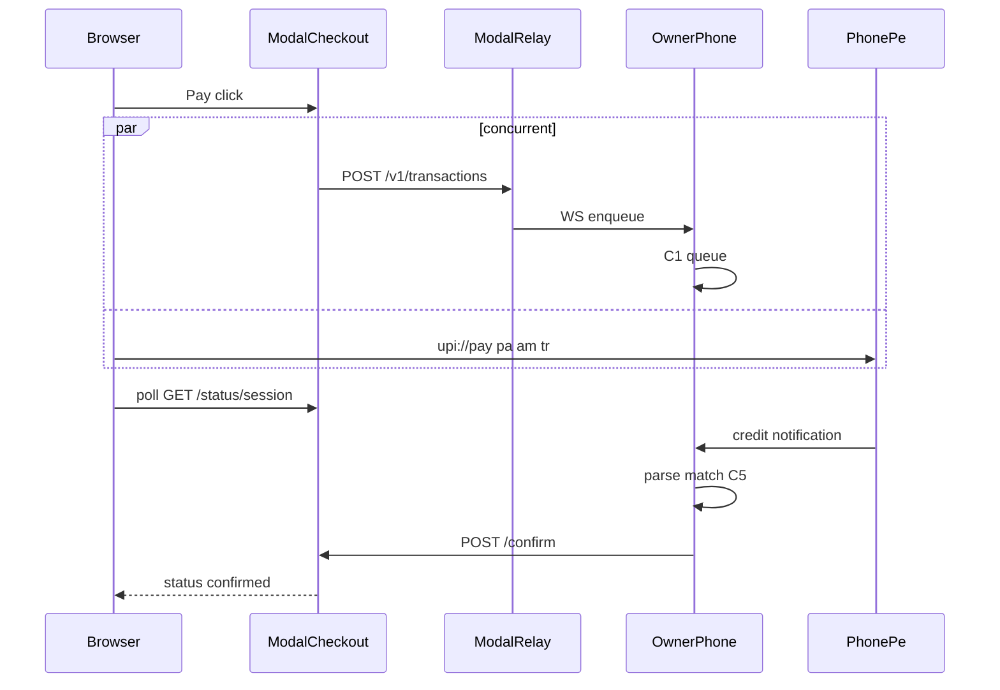

# Three-party UPI loop (PhonePe, any network)

Sequential phases. **Phase 2’s written answer is a hard gate** for 2.5. The Pay page hardcodes VPA, payee name, and merchant_id from a Modal secret / gitignored config (not customer-editable — an editable VPA next to a display name is a phishing primitive). Customer fields are only name, email, phone, amount.

Public relay URL: `https://sohan-spec--relay.modal.run`. Copy `merchant_id` from the owner app Settings into the gitignored checkout config after install/rotate — do not paste it into shared docs. Rotate `RELAY_SECRET` off `hello` before the Pay page is public.

**Do not edit:** [`relay/app.py`](relay/app.py) (already payload-agnostic: forwards every JSON key except `merchant_id`), [`backend/app/confirm.py`](backend/app/confirm.py), [`backend/app/queue.py`](backend/app/queue.py) lock / conflict enqueue / `expire_due` loop. PII wiping happens on the `PendingEntry` objects from [`runtime.py`](backend/app/runtime.py) after those APIs return.

---

## Phase 2 — Capture real PhonePe banners (no matcher redesign yet)

Physical: DND off, notification access on, three small **inbound** PhonePe credits to this iQOO’s merchant VPA.

Capture unmodified `title`/`text` from:
- `adb logcat -s RelayRaw:I`
- `adb shell curl -s http://127.0.0.1:8787/v1/internal/snapshot` → `recent_raw_notifications`

**Stop and write the answer to: does the OS banner (not in-app detail, not SMS) contain a masked payer phone last-4 (or similar)?** Quote structure like `Rs.150 received from XXXXXX1234` vs name-only.

- If last-4 **is** a phone tail → Phase 2.5 then 2.6 with phone required.
- If absent or not a phone → **skip 2.5**, keep today’s matcher, mark last-4 validated-false; 2.6 still adds email/phone on the wire but **phone stays optional**.

Either path: replace [`backend/app/fixtures/phonepe_credits.json`](backend/app/fixtures/phonepe_credits.json); assert in [`backend/tests/test_parser.py`](backend/tests/test_parser.py). Fix [`parser.py`](backend/app/parser.py) regexes against the real strings (`_CREDIT` / `_AMOUNT` / `_FROM` / `_DEBIT` / `_PROMO`). One more live credit → `recent_credits` amount+name (and last4 if that path). One real non-credit (outbound/promo) must not appear in `recent_credits`.

Then **rebuild/install the APK** (Chaquopy bundles `backend/`).

---

## Phase 2.5 — Last-4 matcher (only if Phase 2 said yes)

[`parser.py`](backend/app/parser.py): extract `payer_phone_last4` as its own field (regex from the captured format). Change `parse_credit` to a small result object or 3-tuple `(amount, payer_name, last4|None)` — not stuffed into `payer_name`.

[`models.py`](backend/app/models.py) `CreditEvent`: add `payer_phone_last4: str | None`.

[`matcher.py`](backend/app/matcher.py) order (comment the email rule here too):

0. pending only  
1. exact amount  
2. 5-minute window  
3. if multiple: last-4 of stored `customer_phone` vs extracted field  
4. if still 0 or many: **existing name normalize**, then oldest `created_at`  
5. none → no confirm (unchanged)

Precise timestamp tightening: **only** if the captured banner has a parseable clock, not “2 min ago”. Otherwise skip.

Tests in [`backend/tests/test_matcher.py`](backend/tests/test_matcher.py): last-4 narrows; last-4 collision → name+oldest; missing last4 → no crash, name/oldest fallback. Re-run `test_race.py` / `test_double_confirm.py`.

[`runtime.py`](backend/app/runtime.py) `ingest_notification`: pass last4 into `CreditEvent` (tuple unpack change only).

---

## Phase 2.6 — Enqueue schema (both Phase 2 branches)

Fields on `PendingEntry` + `to_public_dict`: `customer_phone`, `customer_email` (nullable strings).

[`api/storefront.py`](backend/app/api/storefront.py) + [`runtime.enqueue`](backend/app/runtime.py): accept the new keys. Normalize phone (strip spaces/dashes/`+91`/`91`/`0` → 10 digits).

- Last-4 path: **require** valid 10-digit phone or `400`.
- Name-only path: phone optional.

`customer_email` always optional. Matcher must not read it (explicit comment).

PII: after `expire_due` in `sweep_expired`, set phone/email `None` on those entries. After confirm, a short age (e.g. same 300s window or a small constant) clear phone/email on confirmed rows. Do **not** evict rows (queue still needs them for `confirm_acked`). Snapshot tests: pending shows fields; expired/aged-confirmed snapshot/get has nulls.

Owner UI: [`pending_list.dart`](owner_app/lib/ui/widgets/pending_list.dart) and pretty [`mapping.dart`](owner_app/lib/demo_ui/mapping.dart) so name, email, phone, amount are visible on pending (Phase 4 verify).

Relay: **read-only check** of the forward dict — no relay code.

Rebuild APK again if 2.5/2.6 landed after the Phase 2 APK.

---

## Phase 3 + 4 — One new Modal app (do not modify `relay/`)

New app [`checkout/modal_app.py`](checkout/modal_app.py): `min_containers=1`, `max_containers=1`, `@modal.concurrent(max_inputs=…)` (current Modal 1.5 name; not `allow_concurrent_inputs`). Default Function timeout is enough — `/confirm` and `/status` are short HTTP, not a WebSocket. Same Hub caveat: in-memory map must see both POST and GET on one container.

Routes:
- `POST /confirm` — C5 body `{session_id, status}`; store `{status, confirmed_at}`; return 200 immediately
- `GET /status/{session_id}` — unknown → `{status:"pending"}`; after confirm → `{status:"confirmed", confirmed_at}`
- `GET /` — the Pay page (same origin → no CORS fight)

Verify concurrency: manual confirm on phone with `callback_url` = this `/confirm`; poll `/status/{id}`.

Pay page (single HTML+JS):
- Customer fields only: name, email, **“Mobile number linked to your UPI app”**, amount
- VPA, payee name, merchant_id injected from server env (shown read-only so the customer sees the real payee)
- UUID `session_id` before click
- Same click, **no await-before-navigate**: `fetch` POST relay `/v1/transactions` (`session_id`, `customer_name`, `customer_email`, `customer_phone`, `amount`, `merchant_id`, `callback_url` → this app’s `/confirm`) **and** `location.href = "upi://pay?pa=&pn=&am=&cu=INR&tr="` with comment: `tr=` is paying-side audit only, **not** used in matching
- Bare `upi://` only (NPCI chooser)
- Immediate awaiting UI; poll `/status/{id}` every 2s; `visibilitychange` → poll now; on confirmed stop and show “Payment received — order confirmed”

---

## Phases 5–6 — Device evidence (no product code unless something fails)

5. Fresh install, real Doze Allow, iQOO Autostart from [`DEVICE_SETUP.md`](owner_app/DEVICE_SETUP.md), paste the rotated secret from `relay/.secret`. After install, update gitignored checkout merchant_id (new UUID) and redeploy checkout — not a form field. Phone on **mobile data**, screen locked ≥5 min, submit the **real page** from another network; repeat once. Full reboot, do not open the app, 60s, `dumpsys activity services` + whether Modal still gets enqueue / Python snapshot. Report which layer dies if either does.

6. Three G6 wall-clocks (authorize in PhonePe → page flips confirmed). One same-amount collision, two phones/numbers, two tabs; last-4 or name-fallback must assign each tab correctly.

---

## APK / deploy order

1. Phase 2 fixtures+parser → APK  
2. 2.5/2.6 if applicable → APK  
3. `modal deploy` checkout app (no relay redeploy unless secret/health broke)  
4. Device phases on that APK + live URLs
